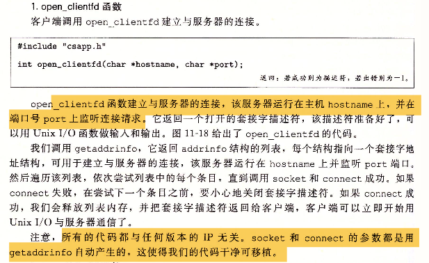
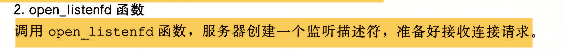
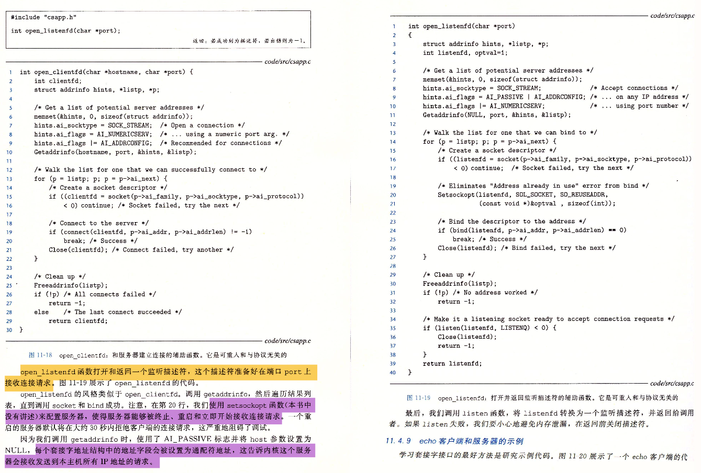

# 套接字接口

## 非常非常重要！

套接字接口是一组函数，它们和Unix I/O函数结合起来，用以创建网络应用。大多数现代系统上都实现了套接字接口，包括所有的Unix变种、Windows和Macintosh系统。

 

## 1. 套接字地址结构

 

## 2. socket函数

 

## 3. connect函数

 

## 4. bind函数

 

## 5. listen函数

 

## 6. accept函数

 

## 7. 主机和服务的转换

 

### 7.1 getaddrinfo

 

 

### 7.2 getnameinfo

 

 

### 7.3 示例程序

需要的文件：

+ [csapp.c](https://github.com/niu0217/Documents/blob/main/NetworkProgramming/base/code/csapp.c)

+ [csapp.h](https://github.com/niu0217/Documents/blob/main/NetworkProgramming/base/code/csapp.h)

+ [hostinfo.c](https://github.com/niu0217/Documents/blob/main/NetworkProgramming/base/code/hostinfo.c)

编译：

```bash
gcc -g -o hostinfo hostinfo.c csapp.c -lpthread
```

运行：

```bash
ubuntu@niu0217:~/GithubFile/Documents/NetWorkProgramming$ ./hostinfo twitter.com
104.244.42.65
104.244.42.1
104.244.42.129
104.244.42.193
```

## 8. 套接字接口的辅助函数

备注：下面两个函数都来自于文件：[csapp.c](https://github.com/niu0217/Documents/blob/main/NetworkProgramming/base/code/csapp.c)

### 8.1 open_clientfd

 

```c
/******************************** 
 * Client/server helper functions
 ********************************/
/*
 * open_clientfd - Open connection to server at <hostname, port> and
 *     return a socket descriptor ready for reading and writing. This
 *     function is reentrant and protocol-independent.
 *
 *     On error, returns: 
 *       -2 for getaddrinfo error
 *       -1 with errno set for other errors.
 */
/* $begin open_clientfd */
int open_clientfd(char *hostname, char *port) {
    int clientfd, rc;
    struct addrinfo hints, *listp, *p;

    /* Get a list of potential server addresses */
    memset(&hints, 0, sizeof(struct addrinfo));
    hints.ai_socktype = SOCK_STREAM;  /* Open a connection */
    hints.ai_flags = AI_NUMERICSERV;  /* 强制参数service为端口号而不是服务名 */
    hints.ai_flags |= AI_ADDRCONFIG;  /* Recommended for connections */
    if ((rc = getaddrinfo(hostname, port, &hints, &listp)) != 0) {
        fprintf(stderr, "getaddrinfo failed (%s:%s): %s\n", hostname, port, gai_strerror(rc));
        return -2;
    }
  
    /* Walk the list for one that we can successfully connect to */
    for (p = listp; p; p = p->ai_next) {
        /* Create a socket descriptor */
        if ((clientfd = socket(p->ai_family, p->ai_socktype, p->ai_protocol)) < 0) 
            continue; /* Socket failed, try the next */

        /* Connect to the server */
        if (connect(clientfd, p->ai_addr, p->ai_addrlen) != -1) 
            break; /* Success */
        if (close(clientfd) < 0) { /* Connect failed, try another */  //line:netp:openclientfd:closefd
            fprintf(stderr, "open_clientfd: close failed: %s\n", strerror(errno));
            return -1;
        } 
    } 

    /* Clean up */
    freeaddrinfo(listp);
    if (!p) /* All connects failed */
        return -1;
    else    /* The last connect succeeded */
        return clientfd;
}
/* $end open_clientfd */

```

### 8.2 open_listenfd

 

 

```c
/*  
 * open_listenfd - Open and return a listening socket on port. This
 *     function is reentrant and protocol-independent.
 *
 *     On error, returns: 
 *       -2 for getaddrinfo error
 *       -1 with errno set for other errors.
 */
/* $begin open_listenfd */
int open_listenfd(char *port) 
{
    struct addrinfo hints, *listp, *p;
    int listenfd, rc, optval=1;

    /* Get a list of potential server addresses */
    memset(&hints, 0, sizeof(struct addrinfo));
  	//AI_PASSIVE：告诉函数getaddrinfo，返回的套接字地址可能被服务器用作监听套接字。
  	//            这个时候，host参数应该设置为NULL，表示接受任意的IP地址
    hints.ai_socktype = SOCK_STREAM;             /* Accept connections */
    hints.ai_flags = AI_PASSIVE | AI_ADDRCONFIG; /* ... on any IP address */
    hints.ai_flags |= AI_NUMERICSERV;            /* ... 强制参数service为端口号，而不是服务名 */
    if ((rc = getaddrinfo(NULL, port, &hints, &listp)) != 0) {
        fprintf(stderr, "getaddrinfo failed (port %s): %s\n", port, gai_strerror(rc));
        return -2;
    }

    /* Walk the list for one that we can bind to */
    for (p = listp; p; p = p->ai_next) {
        /* Create a socket descriptor */
        if ((listenfd = socket(p->ai_family, p->ai_socktype, p->ai_protocol)) < 0) 
            continue;  /* Socket failed, try the next */

        /* Eliminates "Address already in use" error from bind */
        setsockopt(listenfd, SOL_SOCKET, SO_REUSEADDR,    //line:netp:csapp:setsockopt
                   (const void *)&optval , sizeof(int));

        /* Bind the descriptor to the address */
        if (bind(listenfd, p->ai_addr, p->ai_addrlen) == 0)
            break; /* Success */
        if (close(listenfd) < 0) { /* Bind failed, try the next */
            fprintf(stderr, "open_listenfd close failed: %s\n", strerror(errno));
            return -1;
        }
    }


    /* Clean up */
    freeaddrinfo(listp);
    if (!p) /* No address worked */
        return -1;

    /* Make it a listening socket ready to accept connection requests */
    if (listen(listenfd, LISTENQ) < 0) {
        close(listenfd);
				return -1;
    }
    return listenfd;
}
/* $end open_listenfd */
```


