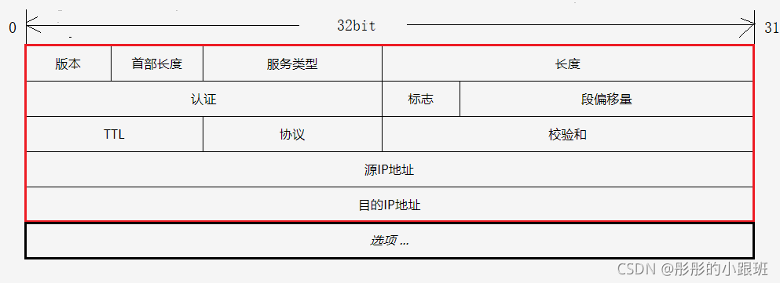
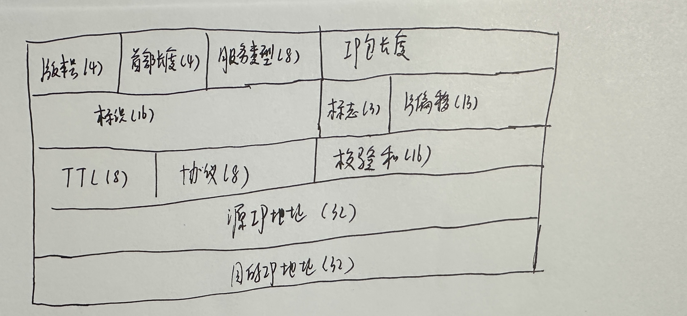
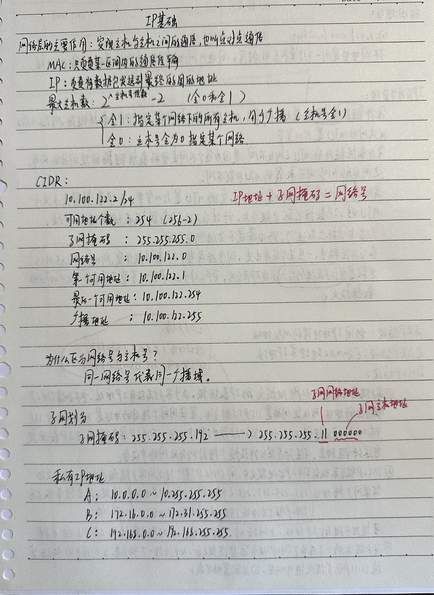
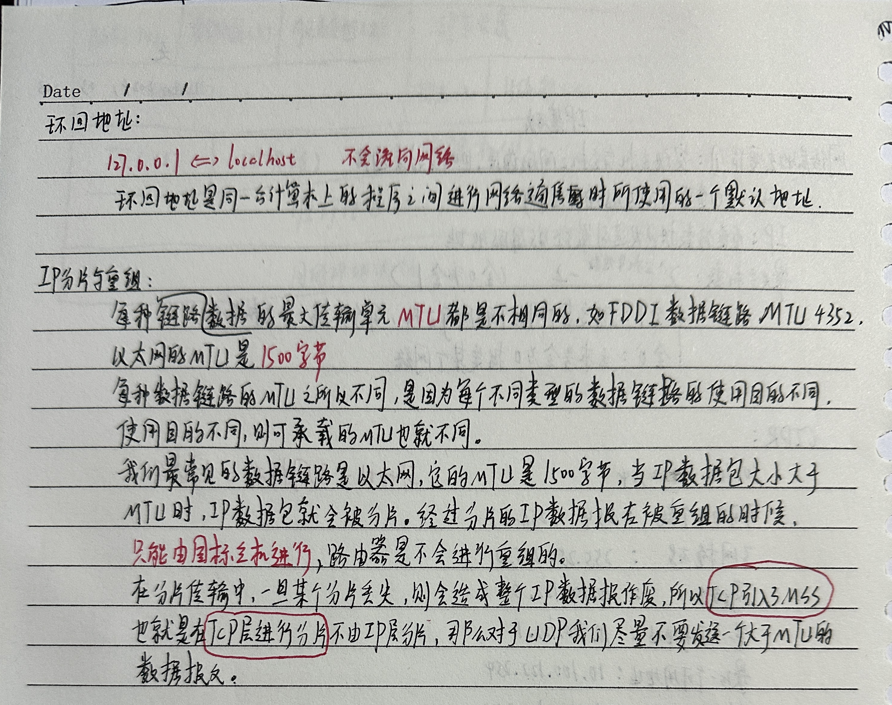

# IP

## IP头

https://blog.csdn.net/weixin_45583303/article/details/119984861?spm=1001.2014.3001.5506

 

   

+ 版本号（4）：长度4bit，标识目前采用的IP协议的版本号，一般的值0100（IPv4），0110（IPv6）
+ 首部长度（4）：长度4bit，这个字段的作用是为了描述IP头部的长度，IP头部长度是可变的。

```
- 首部长度部分占4个bit位，取值范围是0-15，单位为32bit（4个字节）
- 整个IP头部占空间大小=首部长度值*4(单位/字节)

- 所以可变的IP头部的大小最大为60字节：15*4=60

- 一般使用的是5行，每行4字节，5*4=20字节
```

+ 服务类型（8）：长度8bit， 按位被如下定义，包括3bit的优先权字段（000-111），4 bit的TOS字段，1 bit未用位但必须置0。

| 0    | 1    | 2    | 3    | 4    | 5    | 6    | 7    |
| ---- | ---- | ---- | ---- | ---- | ---- | ---- | ---- |
| P    | P    | P    | D    | T    | C    | R    | 0    |

PPP：定义包的优先级，取值越大数据越重要。

| 000  | Routine（普通）                  |
| ---- | -------------------------------- |
| 001  | Priority（优先）                 |
| 010  | Immediate（快速）                |
| 011  | Flash（闪速）                    |
| 100  | Flash Override（疾速）           |
| 101  | Internetwork Control（网间控制） |
| 110  | Network Control（网络控制）      |
| 111  | Critic（关键）                   |

```
- 优先级0为默认标记值。
- 优先级1和2给数据业务使用。
- 优先级3给语音控制数据使用。
- 优先级4由视频会议和视频流使用。
- 优先级5推荐给语音数据使用。
- 优先级6和7一般保留给网络控制数据使用，如路由。

注意：在标记数据时，既可以使用数值，也可以使用名称（英文名称）。
```

| TOS字段    | 0    | 1            |
| ---------- | ---- | ------------ |
| D 时延     | 普通 | 延迟尽量小   |
| T 吞吐量   | 普通 | 流量尽量大   |
| R 可靠性   | 普通 | 可靠性尽量大 |
| M 传输成本 | 普通 | 成本尽量小   |

```
- TOS字段的4 bit中只能置其中1 bit，可以都为0，如果所有4 bit均为0，那么就意味着是一般服务。
- 举例：
	- 网络视屏要求最小的传输时延。
	- 文件传输要求最大吞吐量
	- 网络管理和路由要求高可靠性。
	- 用户网络新闻要求最小费用。
```

+ IP包长度（16）：
  + IP包=IP头部+数据
  + IP包最大长度65535字节
+ 标识（16）：
+ 标志（3）：长度3bit，是一个3位的控制字段。

| 0      | 1                                                            | 2                                                            |
| ------ | ------------------------------------------------------------ | ------------------------------------------------------------ |
| 不使用 | DF（Don’t Fragment）位，DF位设为1时表明路由器不能对该上层数据包分段 | MF（More Fragments）位，当路由器对一个上层数据包分段，则路由器会在除了最后一个分段的IP包的包头中将MF位设为1 |

```
- 保留位：1位
- 不分段位：1位，取值：0（允许数据报分段）、1（数据报不能分段）
- 更多段位：1位，取值：0（数据包后面没有包，该包为最后的包）、1（数据包后面有更多的包）

- 举例：
	- 如果分数据包分两段：
		- 第一个的Flags为：101
		- 第二个Flags就为：100
```

+ 片偏移（13）：长度13bit，表示该IP包在该组分片包中位置，接收端靠此来组装还原IP包。
+ TTL（8）：长度8bit，当IP包进行传送时，先会对该字段赋予某个特定的值，当IP包经过每一个沿途的路由器的时候，每个沿途的路由器会将IP包的TTL值减少1，如果TTL减少为0，则该IP包会被丢弃，`这个字段可以防止由于路由环路而导致IP包在网络中不停被转发`。
+ 协议（8）：长度8bit，标识了上层所使用的协议，以下是比较常用的协议号：

| 1    | ICMP |
| ---- | ---- |
| 2    | IGMP |
| 6    | TCP  |
| 17   | UDP  |
| 88   | IGRP |
| 89   | OSPF |

+ 校验和（16）：长度16bit，用来做`IP头部的正确性检测`，不包含数据部分。 因为每个路由器要改变TTL的值，所以路由器会为每个通过的数据包重新计算这个值。
+ 源IP地址（32）和目的IP地址（32）：这两个地段都是32bit，标识了这个IP包的起源和目的地址（`源IP地址指的就是发送数据包的那个电脑的IP地址，目的IP地址就是想要发送到的那个电脑的IP地址`），要注意除非使用NAT，否则整个传输的过程中，这两个地址不会改变。

+ 可选项（Options）：这是一个可变长的字段，该字段属于可选项，主要用于测试，由起源设备根据需要改写，可选项目包含以下内容：

  + 松散源路由（Loose source routing）：给出一连串路由器接口的IP地址。IP包必须沿着这些IP地址传送，但是允许在相继的两个IP地址之间跳过多个路由器。

  + 严格源路由（Strict source routing）：给出一连串路由器接口的IP地址。IP包必须沿着这些IP地址传送，如果下一跳不在IP地址表中则表示发生错误。

  + 路由记录（Record route）：当IP包离开每个路由器的时候记录路由器的出站接口的IP地址。

  + 时间戳（Timestamps）：当IP包离开每个路由器的时候记录时间。

  + 填充（Padding）：因为IP包头长度（Header Length）部分的单位为32bit，所以IP包头的长度必须为32bit的整数倍。因此，在可选项后面，IP协议会填充若干个0，以达到32bit的整数倍。

## IP地址和子网掩码

IP地址和子网掩码是网络中常见的概念，它们之间有着密切的关系。在理解它们之间的关系之前，我们需要先理解它们各自的含义。

IP地址（Internet Protocol Address）是用于在网络上唯一标识设备的地址，它采用IPv4或IPv6标准。IPv4地址通常由32位二进制数表示（通常以十进制表示，如192.168.1.1），而IPv6地址通常由128位二进制数表示，采用八组四位十六进制数表示。

子网掩码（Subnet Mask）是用于划分网络中主机和网络地址的一种技术。它和IP地址一起使用，用于确定网络中的子网数量以及特定主机在网络中的位置。子网掩码也采用IPv4或IPv6标准，用于指示IP地址中网络部分和主机部分的划分。

在IPv4中，子网掩码通常是形如255.255.255.0的形式，而在IPv6中，子网掩码的表示方式有所不同。

IP地址和子网掩码之间的关系体现在网络地址的计算上，子网掩码的作用是将IP地址划分为网络部分和主机部分。子网掩码使用“1”来表示网络部分，使用“0”来表示主机部分。当IP地址和子网掩码进行逻辑与运算时，可以确定网络地址。

具体而言，计算网络地址的方法是将IP地址和子网掩码进行逻辑与运算，得到的结果即为该IP地址所在网络的网络地址。

例如，对于IP地址192.168.1.10，子网掩码255.255.255.0，逻辑与运算如下：

```
IP地址：   11000000.10101000.00000001.00001010
子网掩码： 11111111.11111111.11111111.00000000
逻辑与：   11000000.10101000.00000001.00000000 (192.168.1.0)
```

因此，该IP地址192.168.1.10在子网掩码为255.255.255.0的情况下，属于网络192.168.1.0。

这种关系使得子网掩码能够有效地将IP地址划分为不同的子网，使网络管理更加灵活和高效。

## 基础

 

## IP分片与重组

 

