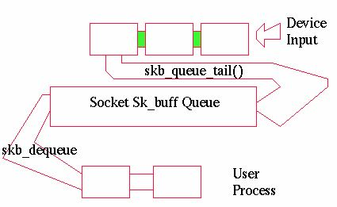
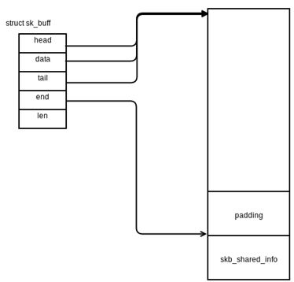
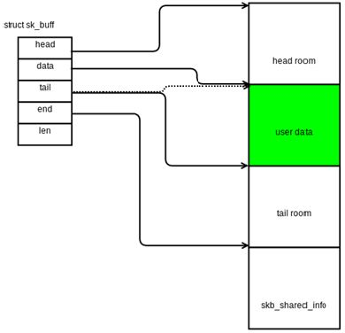
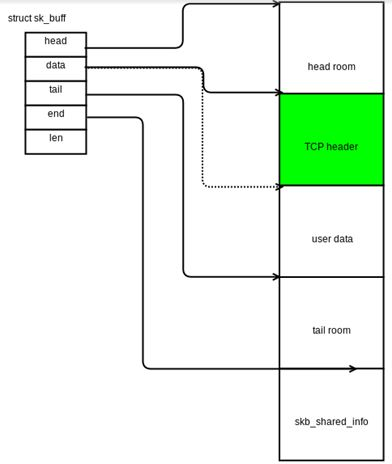
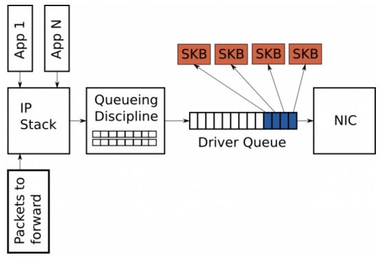
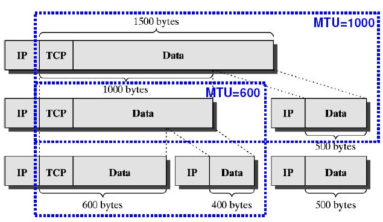

# Linux-sk_buff-struct 数据结构和队列

## 外部资料

https://www.cnblogs.com/sammyliu/p/5225623.html

## 1. sk_buff

### 1.1 sk_buff 是什么

当网络包被内核处理时，底层协议的数据被传送更高层，当数据传送时过程反过来。由不同协议产生的数据(包括头和负载)不断往下层传递直到它们最终被发送。因为这些操作的速度对于网络层的表现至关重要，内核使用一个特定的结构叫 sk_buff， 其定义文件在 [skbuffer.h](http://lxr.free-electrons.com/source/include/linux/skbuff.h)。Socket buffer被用来在网络实现层交换数据而不用拷贝来或去数据包 –这显著获得速度收益。

- sk_buff 是 Linux 网络的一个核心数据结构，其定义文件在 [skbuffer.h](http://lxr.free-electrons.com/source/include/linux/skbuff.h)。
- socket kernel buffer （skb） 是 Linux 内核网络栈（L2 到 L4）处理网络包（packets）所使用的 buffer，它的类型是 sk_buffer。简单来说，一个 skb 表示 Linux 网络栈中的一个 packet；TCP 分段和 IP 分组生产的多个 skb 被一个 skb list 形式来保存。
- struct sock 有三个 skb 队列（sk_buffer queue），分别是 rx , tx 和 err。

 

它的主要结构成员：

```c
struct sk_buff {
    /* These two members must be first. */ # packet 可以存在于 list 或者 queue 中，这两个成员用于链表处理
    struct sk_buff        *next;
    struct sk_buff        *prev;
    struct sk_buff_head    *list; #该 packet 所在的 list
 ...
    struct sock        *sk;      #跟该 skb 相关联的 socket
    struct timeval        stamp; # packet 发送或者接收的时间，主要用于 packet sniffers
    struct net_device    *dev;  #这三个成员跟踪该 packet 相关的 devices，比如接收它的设备等
    struct net_device    *input_dev;
    struct net_device    *real_dev;

    union {                  #指向各协议层 header 结构
        struct tcphdr    *th;
        struct udphdr    *uh;
        struct icmphdr    *icmph;
        struct igmphdr    *igmph;
        struct iphdr    *ipiph;
        struct ipv6hdr    *ipv6h;
        unsigned char    *raw;
    } h;

    union {
        struct iphdr    *iph;
        struct ipv6hdr    *ipv6h;
        struct arphdr    *arph;
        unsigned char    *raw;
    } nh;

    union {
        unsigned char    *raw;
    } mac;

    struct  dst_entry    *dst; #指向该 packet 的路由目的结构，告诉我们它会被如何路由到目的地
    char            cb[40];    # SKB control block，用于各协议层保存私有信息，比如 TCP 的顺序号和帧的重发状态
    unsigned int        len, #packet 的长度
                data_len,
                mac_len,       # MAC header 长度
                csum;          # packet 的 checksum，用于计算保存在 protocol header 中的校验和。发送时，当 checksum offloading 时，不设置；接收时，可以由device计算

    unsigned char        local_df, #用于 IPV4 在已经做了分片的情况下的再分片，比如 IPSEC 情况下。
                cloned:1, #在 skb 被 cloned 时设置，此时，skb 各成员是自己的，但是数据是shared的
                nohdr:1,  #用于支持 TSO
                pkt_type, #packet 类型
                ip_summed; # 网卡能支持的校验和计算的类型，NONE 表示不支持，HW 表示支持，

    __u32            priority; #用于 QoS
    unsigned short        protocol, # 接收 packet 的协议
                security;
```

### 1.2 skb 的主要操作

1）分配 skb = alloc_skb(len, GFP_KERNEL) 

 

（2）添加 payload （skb_put(skb, user_data_len)）

 

（3）使用 skb->push 添加 protocol header，或者 skb->pull 删除 header

 

## 2. Linux 网络栈使用的驱动队列 

### 2.1 队列

 

在 IP 栈和 NIC 驱动之间，存在一个 driver queue （驱动队列）。典型地，它被实现为 FIFO ring buffer，简单地可以认为它是固定大小的。这个队列不包含 packet data，相反，它只是保存 socket kernel buffer （skb）的指针，而 skb 的使用如上节所述是贯穿内核网络栈处理过程的始终的。

 该队列的输入时 IP 栈处理完毕的 packets。这些packets 要么是本机的应用产生的，要么是进入本机又要被路由出去的。被 IP 栈加入队列的 packets 会被网络设备驱动（hardware driver）取出并且通过一个数据通道（data bus）发到 NIC 硬件设备并传输出去。

 在不使用 TSO/GSO 的情况下，IP 栈发到该队列的 packets 的长度必须小于 MTU。

### 2.2 skb 大小 - 默认最大大小为 NIC MTU

绝大多数的网卡都有一个固定的最大传输单元（maximum transmission unit, MTU）属性，它是该网络设备能够传输的最大帧（frame）的大小。对以太网来说，默认值为 1500 bytes，但是有些以太网络可以支持巨帧（jumbo frame），最大能到 9000 bytes。在 IP 网络栈内，MTU 表示能发给 NIC 的最大 packet 的大小。比如，如果一个应用向一个 TCP socket 写入了 2000 bytes 数据，那么 IP 栈需要创建两个 IP packets 来保持每个 packet 的大小等于或者小于 1500 bytes。可见，对于大数据传输，相对较小的 MTU 会导致产生大量的小网络包（small packets）并被传入 driver queue。这成为 IP 分片 （IP fragmentation）。

下图表示 payload 为 1500 bytes 的 IP 包，在 MTU 为 1000 和 600 时候的分片情况：

 


