# Linux网络协议栈

## 外部资料

https://www.cnblogs.com/sammyliu/p/5225623.html

## Linux网络路径

### 手绘

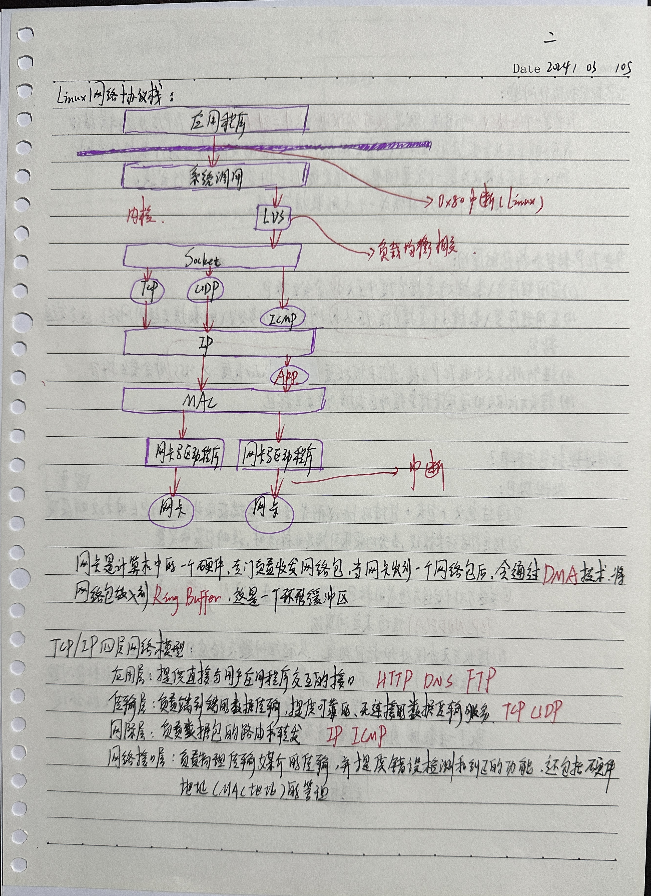 

### 外部资料

 

## 1. 发送端

### 1.1 应用层

#### 1.1.1 socket

应用层的各种网络应用程序基本上都是通过 Linux Socket 编程接口来和内核空间的网络协议栈通信的。Linux Socket 是从 BSD Socket 发展而来的，它是 Linux 操作系统的重要组成部分之一，它是网络应用程序的基础。从层次上来说，它位于应用层，是操作系统为应用程序员提供的 API，通过它，应用程序可以访问传输层协议。

- socket 位于传输层协议之上，屏蔽了不同网络协议之间的差异
- socket 是网络编程的入口，它提供了大量的系统调用，构成了网络程序的主体
- 在Linux系统中，socket 属于文件系统的一部分，网络通信可以被看作是对文件的读取，使得我们对网络的控制和对文件的控制一样方便。

 

+ UDP的socket处理过程：

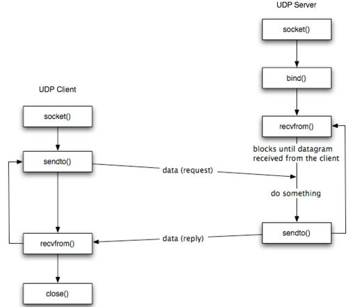 

+ TCP的socket处理过程：

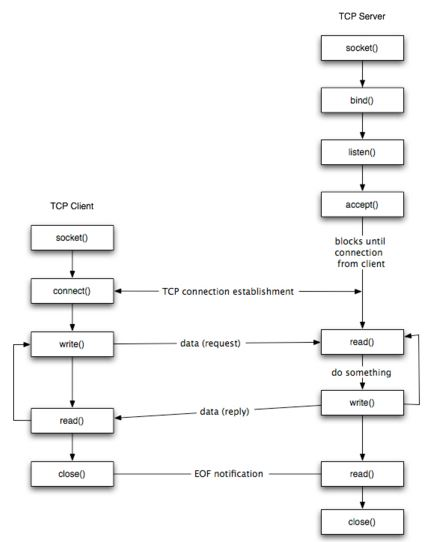 

#### 1.1.2 应用层处理过程

1. 网络应用调用`Socket API *socket (int family, int type, int protocol)*` 创建一个 socket，该调用最终会调用 `Linux system call socket()` ，并最终调用 Linux Kernel 的 `sock_create()` 方法。该方法返回被创建好了的那个 socket 的 file descriptor。对于每一个 userspace 网络应用创建的 socket，在内核中都有一个对应的 struct socket和 struct sock。其中，struct sock 有三个队列（queue），分别是 rx , tx 和 err，在 sock 结构被初始化的时候，这些缓冲队列也被初始化完成；在收据收发过程中，每个 queue 中保存要发送或者接受的每个 packet 对应的 Linux 网络栈 sk_buffer 数据结构的实例 skb。
2. 对于 TCP socket 来说，应用调用 connect（）API ，使得客户端和服务器端通过该 socket 建立一个虚拟连接。在此过程中，TCP 协议栈通过三次握手会建立 TCP 连接。默认地，该 API 会等到 TCP 握手完成连接建立后才返回。在建立连接的过程中的一个重要步骤是，确定双方使用的 Maxium Segemet Size （MSS）。因为 UDP 是面向无连接的协议，因此它是不需要该步骤的。
3. 应用调用 Linux Socket 的 send 或者 write API 来发出一个 message 给接收端
4. sock_sendmsg 被调用，它使用 socket descriptor 获取 sock struct，创建 message header 和 socket control message
5. _sock_sendmsg 被调用，根据 socket 的协议类型，调用相应协议的发送函数。
   1. 对于 TCP ，调用 tcp_sendmsg 函数。
   2. 对于 UDP 来说，userspace 应用可以调用 send()/sendto()/sendmsg() 三个 system call 中的任意一个来发送 UDP message，它们最终都会调用内核中的 udp_sendmsg() 函数。

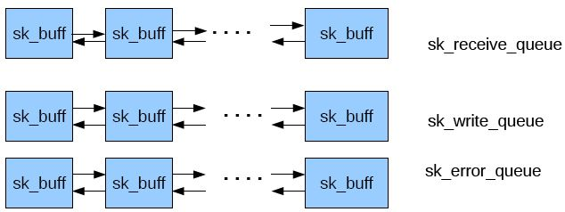 

### 1.2 传输层

 传输层的最终目的是向它的用户提供高效的、可靠的和成本有效的数据传输服务，主要功能包括 （1）构造 TCP segment （2）计算 checksum （3）发送回复（ACK）包 （4）滑动窗口（sliding windown）等保证可靠性的操作。TCP 协议栈的大致处理过程如下图所示： 

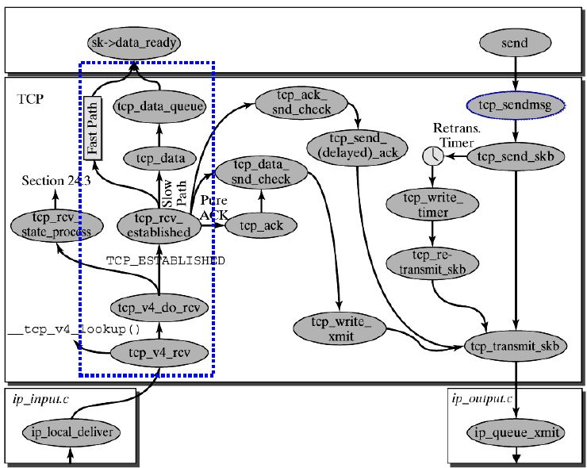 

**TCP 栈简要过程：**

1. tcp_sendmsg 函数会首先检查已经建立的 TCP connection 的状态，然后获取该连接的 MSS，开始 segement 发送流程。
2. 构造 TCP 段的 playload：它在内核空间中创建该 packet 的 sk_buffer 数据结构的实例 skb，从 userspace buffer 中拷贝 packet 的数据到 skb 的 buffer。
3. 构造 TCP header。
4. 计算 TCP 校验和（checksum）和 顺序号 （sequence number）。
   1. TCP 校验和是一个端到端的校验和，由发送端计算，然后由接收端验证。其目的是为了发现TCP首部和数据在发送端到接收端之间发生的任何改动。如果接收方检测到校验和有差错，则TCP段会被直接丢弃。TCP校验和覆盖 TCP 首部和 TCP 数据。
   2. TCP的校验和是必需的
5. 发到 IP 层处理：调用 IP handler 句柄 ip_queue_xmit，将 skb 传入 IP 处理流程。

**UDP 栈简要过程：**

1. UDP 将 message 封装成 UDP 数据报
2. 调用 ip_append_data() 方法将 packet 送到 IP 层进行处理。

### 1.3 网络层

 网络层的任务就是选择合适的网间路由和交换结点， 确保数据及时传送。网络层将数据链路层提供的帧组成数据包，包中封装有网络层包头，其中含有逻辑地址信息- -源站点和目的站点地址的网络地址。其主要任务包括 （1）路由处理，即选择下一跳 （2）添加 IP header（3）计算 IP header checksum，用于检测 IP 报文头部在传播过程中是否出错 （4）可能的话，进行 IP 分片（5）处理完毕，获取下一跳的 MAC 地址，设置链路层报文头，然后转入链路层处理。

IP 栈基本处理过程如下图所示：

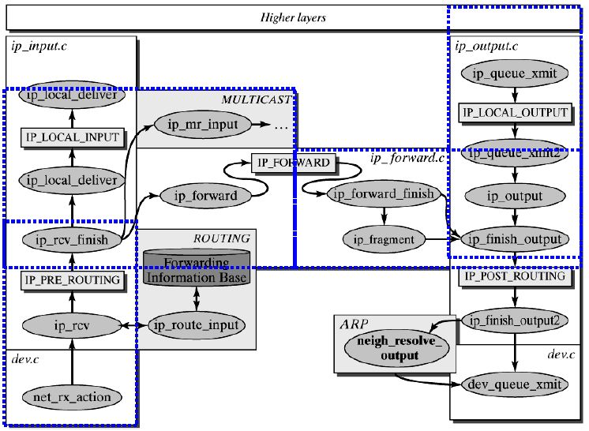 

1. 首先，ip_queue_xmit(skb)会检查skb->dst路由信息。如果没有，比如套接字的第一个包，就使用ip_route_output()选择一个路由。
2. 接着，填充IP包的各个字段，比如版本、包头长度、TOS等。
3. 中间的一些分片等，可参阅相关文档。基本思想是，当报文的长度大于mtu，gso的长度不为0就会调用 ip_fragment 进行分片，否则就会调用ip_finish_output2把数据发送出去。ip_fragment 函数中，会检查 IP_DF 标志位，如果待分片IP数据包禁止分片，则调用 icmp_send()向发送方发送一个原因为需要分片而设置了不分片标志的目的不可达ICMP报文，并丢弃报文，即设置IP状态为分片失败，释放skb，返回消息过长错误码。 
4. 接下来就用 ip_finish_ouput2 设置链路层报文头了。如果，链路层报头缓存有（即hh不为空），那就拷贝到skb里。如果没，那么就调用neigh_resolve_output，使用 ARP 获取。

### 1.4 数据链路层

 功能上，在物理层提供比特流服务的基础上，建立相邻结点之间的数据链路，通过差错控制提供数据帧（Frame）在信道上无差错的传输，并进行各电路上的动作系列。数据链路层在不可靠的物理介质上提供可靠的传输。该层的作用包括：物理地址寻址、数据的成帧、流量控制、数据的检错、重发等。在这一层，数据的单位称为帧（frame）。数据链路层协议的代表包括：SDLC、HDLC、PPP、STP、帧中继等。

  实现上，Linux 提供了一个 Network device 的抽象层，其实现在 linux/net/core/dev.c。具体的物理网络设备在设备驱动中（driver.c）需要实现其中的虚函数。Network Device 抽象层调用具体网络设备的函数。

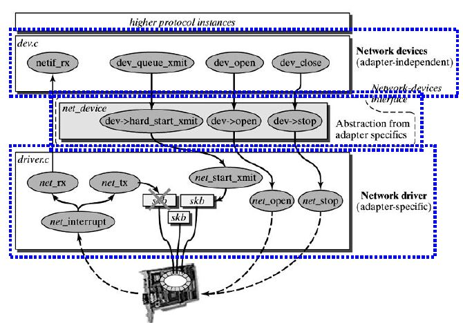 

### 1.5 物理层

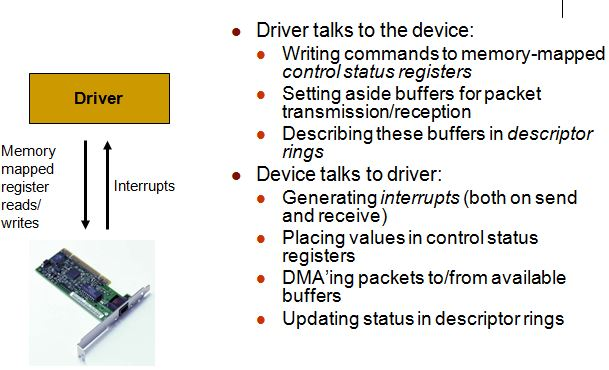 

1. 物理层在收到发送请求之后，通过 DMA 将该主存中的数据拷贝至内部RAM（buffer）之中。在数据拷贝中，同时加入符合以太网协议的相关header，IFG、前导符和CRC。对于以太网网络，物理层发送采用CSMA/CD,即在发送过程中侦听链路冲突。
2. 一旦网卡完成报文发送，将产生中断通知CPU，然后驱动层中的中断处理程序就可以删除保存的 skb 了。

### 1.6 小结

 

## 2. 接收端

### 2.1 物理层和数据链路层

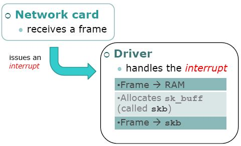 

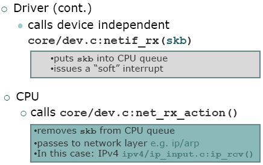 

简要过程：

1. 一个 package 到达机器的物理网络适配器，当它接收到数据帧时，就会触发一个中断，并将通过 DMA 传送到位于 linux kernel 内存中的 rx_ring。
2. 网卡发出中断，通知 CPU 有个 package 需要它处理。中断处理程序主要进行以下一些操作，包括分配 skb_buff 数据结构，并将接收到的数据帧从网络适配器I/O端口拷贝到skb_buff 缓冲区中；从数据帧中提取出一些信息，并设置 skb_buff 相应的参数，这些参数将被上层的网络协议使用，例如skb->protocol；
3. 终端处理程序经过简单处理后，发出一个软中断（NET_RX_SOFTIRQ），通知内核接收到新的数据帧。
4. 内核 2.5 中引入一组新的 API 来处理接收的数据帧，即 NAPI。所以，驱动有两种方式通知内核：(1) 通过以前的函数netif_rx；(2)通过NAPI机制。该中断处理程序调用 Network device的 netif_rx_schedule 函数，进入软中断处理流程，再调用 net_rx_action 函数。
5. 该函数关闭中断，获取每个 Network device 的 rx_ring 中的所有 package，最终 pacakage 从 rx_ring 中被删除，进入 netif _receive_skb 处理流程。
6. netif_receive_skb 是链路层接收数据报的最后一站。它根据注册在全局数组 ptype_all 和 ptype_base 里的网络层数据报类型，把数据报递交给不同的网络层协议的接收函数(INET域中主要是ip_rcv和arp_rcv)。该函数主要就是调用第三层协议的接收函数处理该skb包，进入第三层网络层处理。

### 2.2 网络层

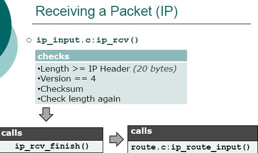 

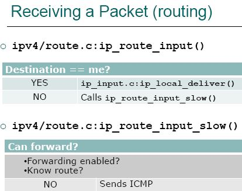 

1. IP 层的入口函数在 ip_rcv 函数。该函数首先会做包括 package checksum 在内的各种检查，如果需要的话会做 IP defragment（将多个分片合并），然后 packet 调用已经注册的 Pre-routing netfilter hook ，完成后最终到达 ip_rcv_finish 函数。
2. ip_rcv_finish 函数会调用 ip_router_input 函数，进入路由处理环节。它首先会调用 ip_route_input 来更新路由，然后查找 route，决定该 package 将会被发到本机还是会被转发还是丢弃：
   1. 如果是发到本机的话，调用 ip_local_deliver 函数，可能会做 de-fragment（合并多个 IP packet），然后调用 ip_local_deliver 函数。该函数根据 package 的下一个处理层的 protocal number，调用下一层接口，包括 tcp_v4_rcv （TCP）, udp_rcv （UDP），icmp_rcv (ICMP)，igmp_rcv(IGMP)。对于 TCP 来说，函数 tcp_v4_rcv 函数会被调用，从而处理流程进入 TCP 栈。
   2. 如果需要转发 （forward），则进入转发流程。该流程需要处理 TTL，再调用 dst_input 函数。该函数会 （1）处理 Netfilter Hook （2）执行 IP fragmentation （3）调用 dev_queue_xmit，进入链路层处理流程。

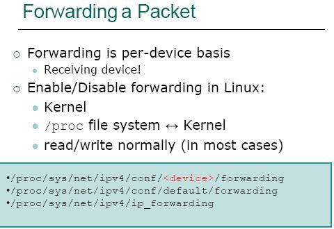 

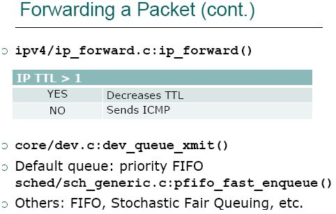 

### 2.3 传输层

1. 传输层 TCP 处理入口在 tcp_v4_rcv 函数（位于 linux/net/ipv4/tcp ipv4.c 文件中），它会做 TCP header 检查等处理。
2. 调用 _tcp_v4_lookup，查找该 package 的 open socket。如果找不到，该 package 会被丢弃。接下来检查 socket 和 connection 的状态。
3. 如果socket 和 connection 一切正常，调用 tcp_prequeue 使 package 从内核进入 user space，放进 socket 的 receive queue。然后 socket 会被唤醒，调用 system call，并最终调用 tcp_recvmsg 函数去从 socket recieve queue 中获取 segment。

### 2.4 应用层

1. 每当用户应用调用 read 或者 recvfrom 时，该调用会被映射为/net/socket.c 中的 sys_recv 系统调用，并被转化为 sys_recvfrom 调用，然后调用 sock_recgmsg 函数。
2. 对于 INET 类型的 socket，/net/ipv4/af inet.c 中的 inet_recvmsg 方法会被调用，它会调用相关协议的数据接收方法。
3. 对 TCP 来说，调用 tcp_recvmsg。该函数从 socket buffer 中拷贝数据到 user buffer。
4. 对 UDP 来说，从 user space 中可以调用三个 system call recv()/recvfrom()/recvmsg() 中的任意一个来接收 UDP package，这些系统调用最终都会调用内核中的 udp_recvmsg 方法。

### 2.5 小结

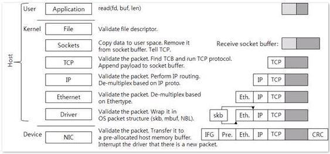 

