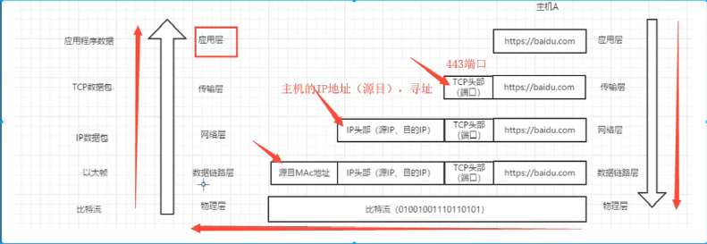
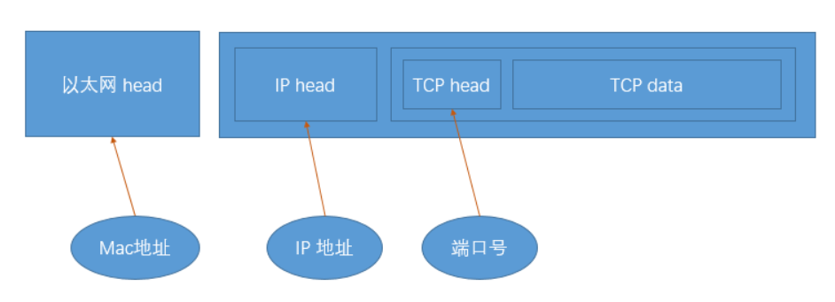

# MAC地址IP地址端口号

在利用TCP/IP协议族进行通信的时候，有三个比较关键的确认身份的信息：MAC地址、IP地址和端口号。

在OSI 模型中，第三层网络层负责 IP 地址，第二层数据链路层则负责 MAC 地址，因此一个主机会有一个 MAC 地址，而每个网络会有一个专属于它的 IP 地址。

## MAC地址

- 在`数据链路层`包裹在以太网头部中的，它主要用来识别同一个链路中的不同计算机。
- MAC地址即网卡号，每块网卡出厂的时候，都有一个全世界独一无二的 MAC 地址，长度是 48 个二进制位，通常用 12 个十六进制数表示。

## IP地址

- IP地址是由`网络地址`和`主机地址`组成
- 在`网络层`的IP头部里，用于识别网络中互联的主机和子网（例如：路由器连接外网，同一个路由器下的所有设备组成子网），通过网络地址确认所在的子网，在子网内部通过MAC地址确认主机地址。

## 端口号

- 在`传输层`包含在TCP/UDP头部中的，用于识别应用程序。
- 一台主机上能运行多个程序，那么接收到的消息到底是哪个程序的呢？就需要端口号来确认。
- 端口号有两种：
  - 固定的端口号：是形如http，telnet，ftp等广为使用的应用协议所使用的端口号是固定的
  - 动态分配的端口号：这个时候服务端要确定监听端口号，接受服务的客户端没必要确定端口号
  - 端口号由传输层协议决定，因此不同传输协议可以使用相同的端口号，所以TCP和UDP可以使用同一个端口号

## 数据传输过程图解

 

 

