# TCP和UDP

## 自己的手绘图

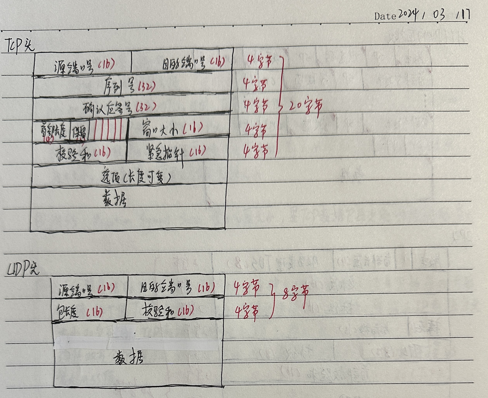 

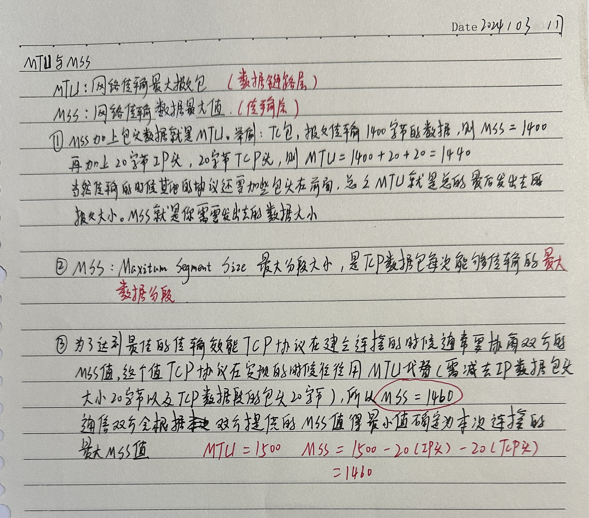 

##  外部资料

https://blog.csdn.net/weixin_45583303/article/details/119984861?spm=1001.2014.3001.5506

### TCP

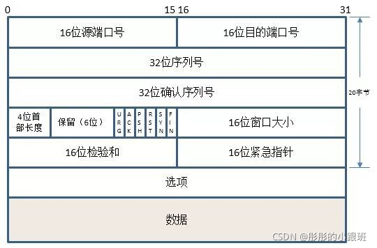 

+ 16位源端口号：发送方的端口号。
+ 16位目的端口号：接收方的端口号。
+ 32位序列号：保证网络传输数据的顺序性。
+ 32位确认号：用来确认确实有收到相关数据包，内容表示期望收到下一个报文的序列号，用来解决丢包问题。
+ 4位头部大小：标识该tcp头部有多少个4字节（32bit），因为4位最大能表示15，所以TCP头部最长为60字节。
+ 6位保留位：预留字段，都为0。
+ 6位标志位：
  + URG：表示紧急指针是否有效。
  + ACK：表示确认号是否有效。
  + PSH：提示接收端应用程序应该立即从tcp接受缓冲区中读走数据，为接受后续数据腾出空间（如果应用程序不将接受的数据读走，它们就会一直保留在tcp缓冲区中）。
  + RST：表示要求对方重新建立连接。携带RST标志的tcp报文段为复位报文段。
  + SYN：表示请求建立一个连接。携带SYN标志的tcp报文段为同步报文段。
  + FIN：表示通知对方本端要关闭连接了。携带FIN标志的TCP报文段为结束报文段。
+ 16位窗口大小：此字段用于进行流量控制，主要用于解决流控拥塞的问题。单位为字节数，这个值是本机期望一次接收的字节数。
+ 16位紧急指针：它是一个偏移值，和序号字段中的值相加表示紧急数据最后一个字节的序号。
+ 32位TCP选项：一般包含在三次握手中。

### UDP

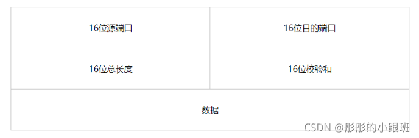 

+ 源端口号：发送方的端口号（主机的应用程序使用的端口号）。
+ 目的端口号：接收方的端口号（目的主机的应用程序使用的端口号）。
+ 总长度：指UDP头部和UDP数据加在一起的字节长度，因为UDP头部长度为8字节，所以该字段的最小值为8。
+ 校验和：检验UDP数据报在传输中是否出错，有错则丢弃。

## 常见问题

### TCP和UDP区别

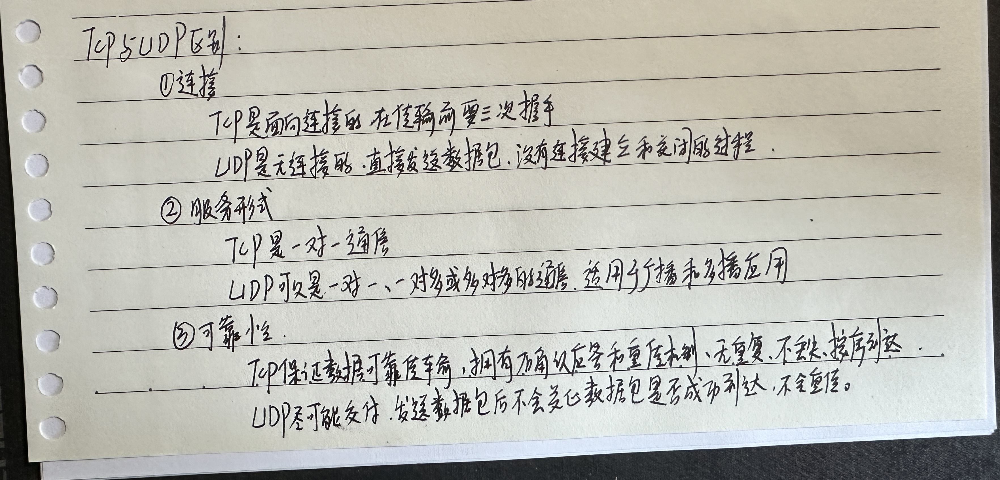 

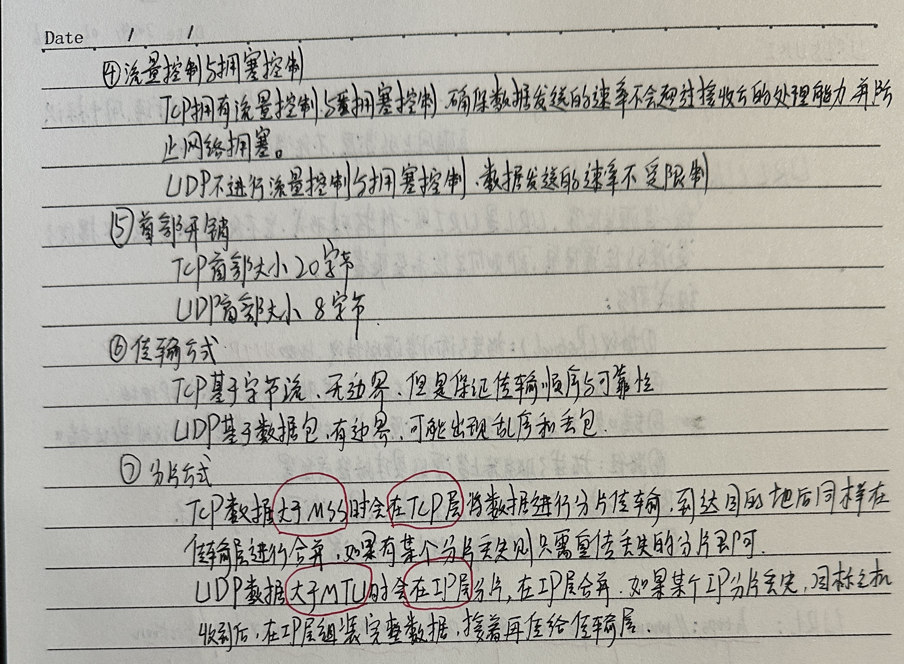 

### TCP三次握手

 

### TCP四次挥手

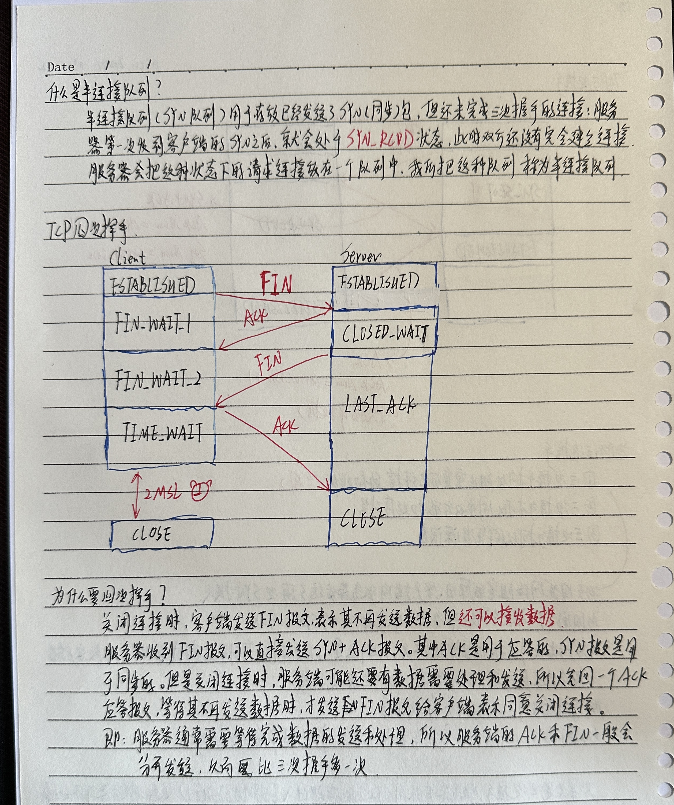 

### TCP分割数据

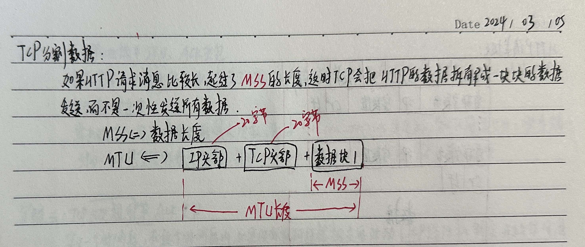 

### 粘包和拆包

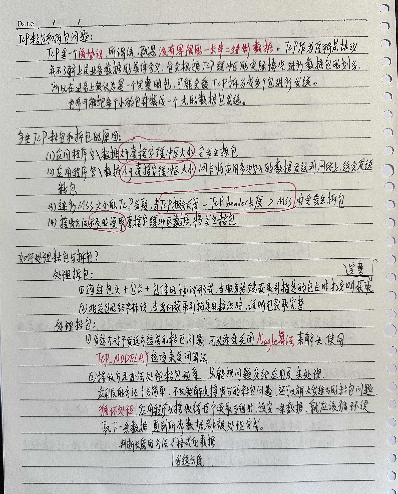 

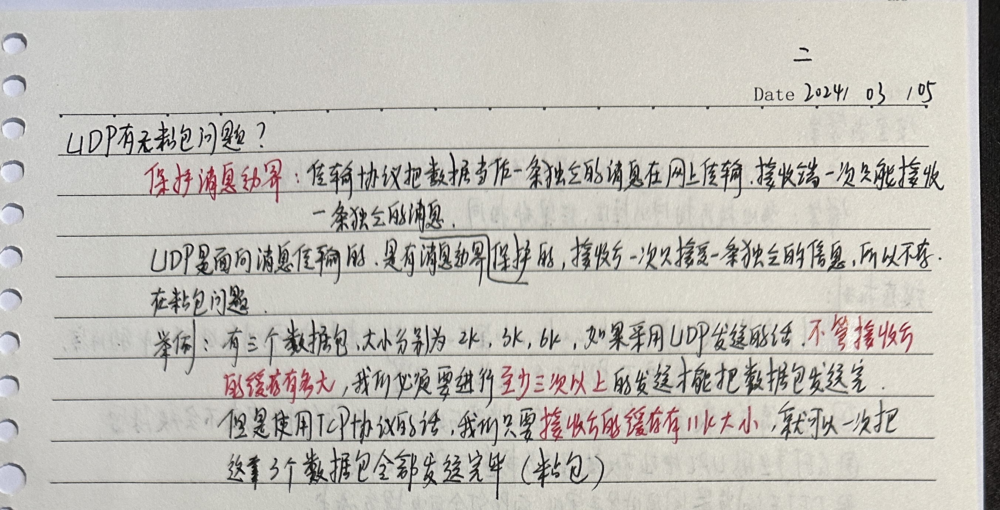 

## 加分知识点

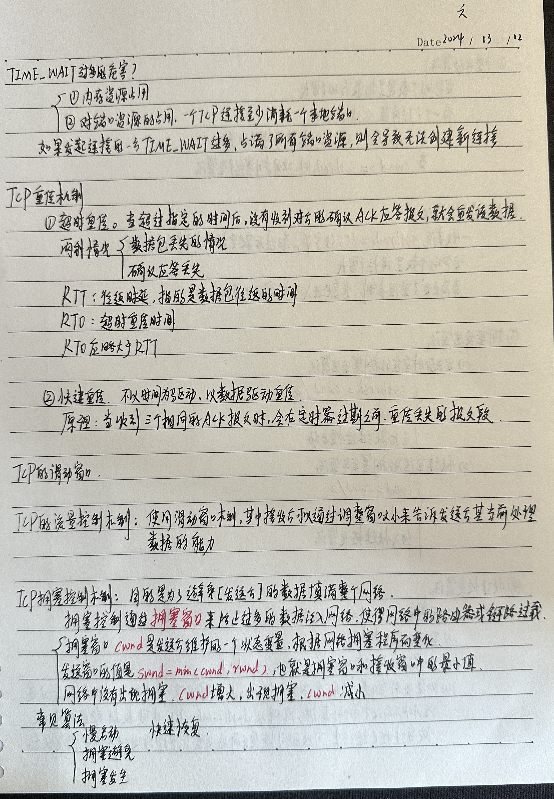 

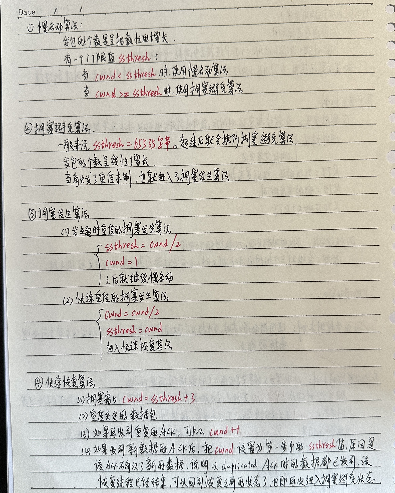 

## TCP优化（绝招）

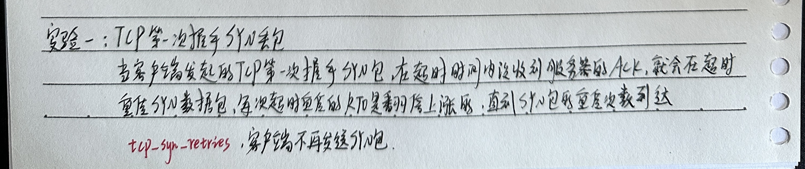 

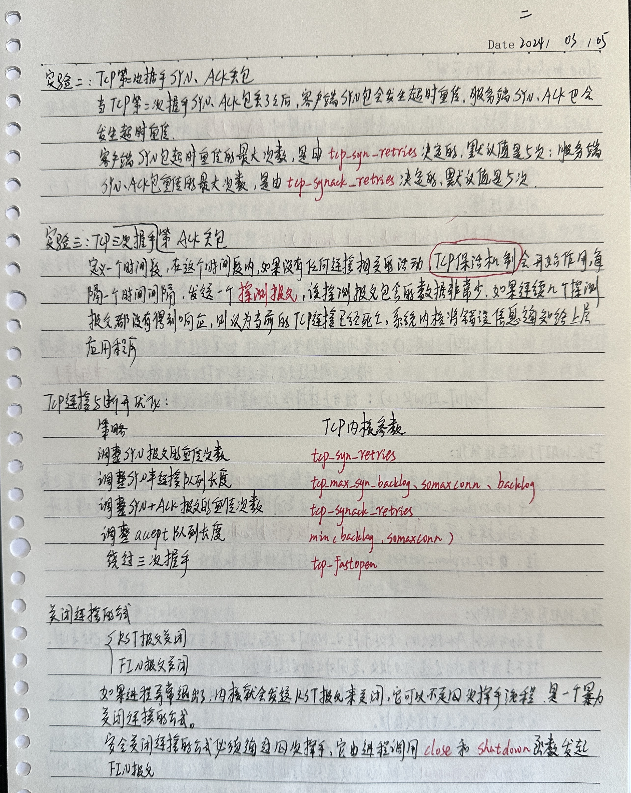 

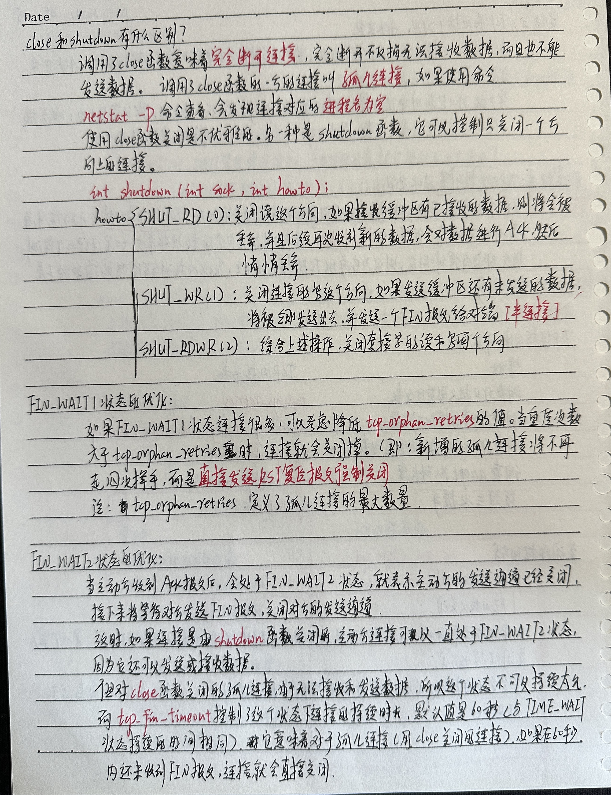 

 

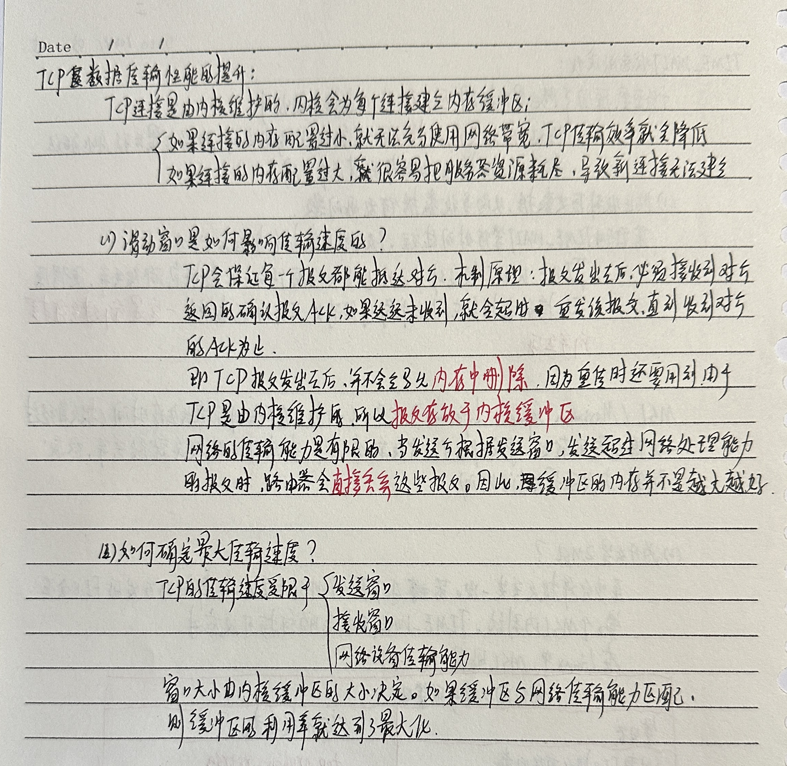 

