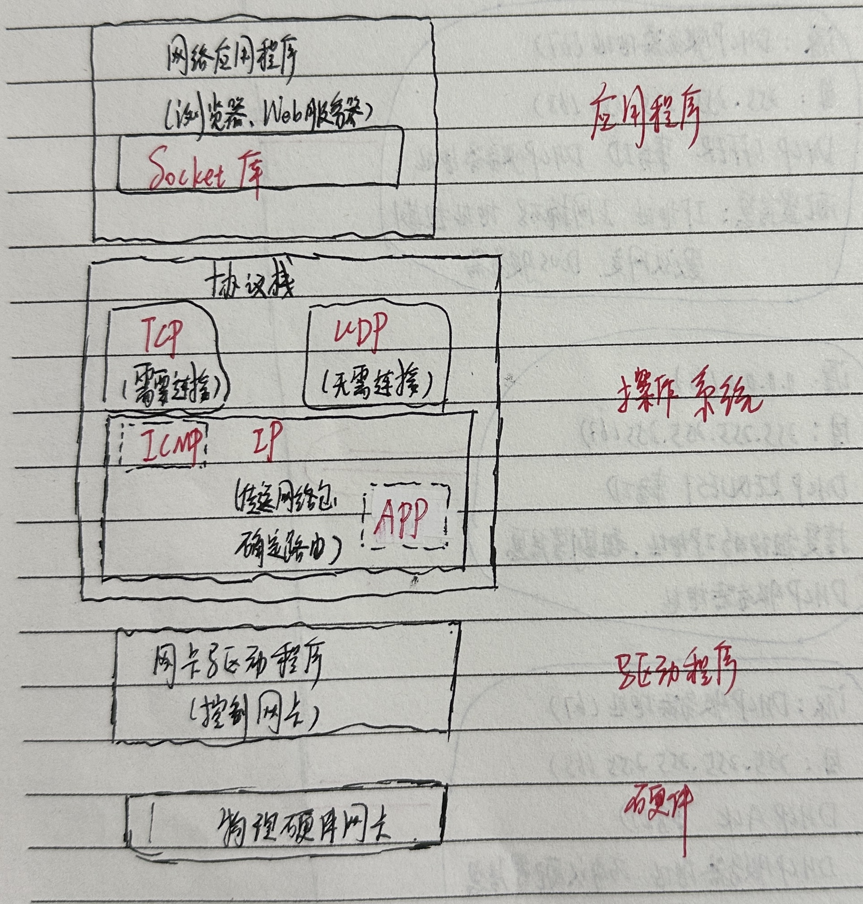
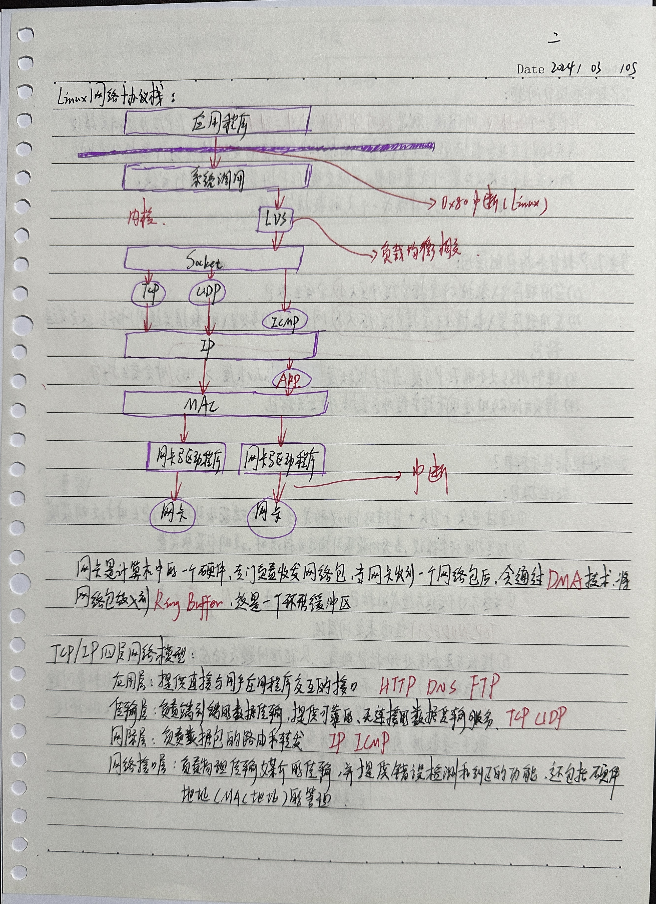
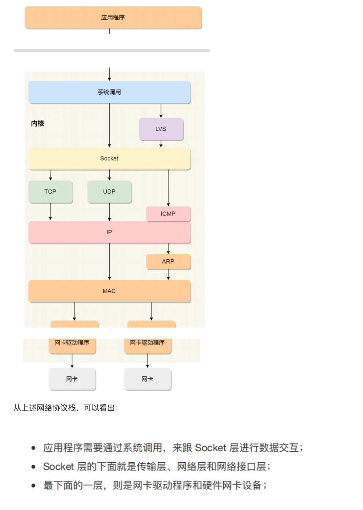
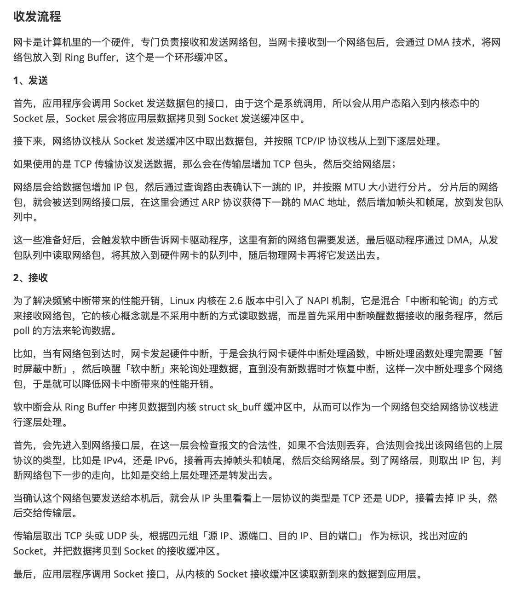

# 协议总结

## 小结

 

## Linux网络协议栈

 

## 外部资料的Linux网络协议栈

 

## 收发流程

 

 

##  补充知识

### 网卡驱动程序和网卡的关系

网卡驱动程序是连接操作系统和网络接口卡（网卡）之间的重要软件组件。它是操作系统内核中的模块，负责管理和控制计算机系统中的网卡。网卡驱动程序的存在使得操作系统能够与特定型号的网卡进行通信，并控制其发送和接收数据包的功能。

网卡则是计算机系统中的硬件设备，用于连接计算机与局域网或广域网，实现数据包的发送和接收。网卡通常包括一个物理接口（如以太网接口）、网卡芯片（用于处理数据包）、传输介质（如网线或光纤）等组成。

网卡驱动程序和网卡之间的关系可以用以下几点来概括：

1. **通信桥梁：** 网卡驱动程序充当了操作系统与网卡之间的桥梁。它理解并遵循相应的硬件通信协议和接口，使得操作系统能够通过标准化的方式与网卡进行通信。
2. **资源管理：** 网卡驱动程序负责管理网卡在系统中的资源分配，包括内存、中断请求（IRQ）、I/O 端口等。这些资源的正确管理对于确保系统能够高效地与网卡进行交互至关重要。
3. **数据包的发送和接收：** 网卡驱动程序负责控制网卡的发送和接收功能。它将操作系统要发送的数据包转换为网卡可理解的格式并发送出去，并将网卡接收到的数据包转换为适合操作系统处理的格式。
4. **执行协议栈处理：** 在一些情况下，网卡驱动程序可能还会处理一部分网络协议栈的工作，例如 TCP/IP 协议的一些基本功能。

总体来说，网卡驱动程序作为操作系统内核的一部分，通过实现一系列规范化的接口和功能，使得操作系统能够与特定型号和型号的网卡进行有效通信和数据处理。没有正确的网卡驱动程序，操作系统无法有效地使用网卡进行网络通信。

