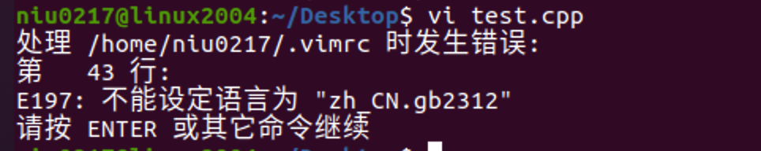

# Ubuntu20.4安装VIM

**1---下载安装包**

```
https://github.com/youngyangyang04/PowerVim
```

**2--进入PowerVim然后打开终端输入命令：**

```shell
sh install.sh
```

此时会报错

```
install.sh: 8: Syntax error: "(" unexpected
```

这是由于版本不同造成的，我们继续往下去解决这个问题。

执行命令：

```shell
sudo dpkg-reconfigure dash
# 在选择项中选No，即可。
```

这样这个问题就完美解决了。

**3--创建一个test.cpp文件。执行命令**

```c++
vi test.cpp
```

出现如下情况：  

这个是语言和没有安装ctag造成的。

首先：执行如下命令安装ctag

```shell
sudo apt-get install ctags
```

然后执行命令`vi test.cpp`

 

是不是发现少了一个错误，因为我们已经安装了ctag所以少了一个错误，接下来解决语言的错误。

```
https://gist.github.com/BoWang816/c2e9ce52ce03c59450bcf587b7d0f456


ubuntu中文支持，及中文乱码问题

该篇博文，是本人踩了一下午的坑的成果，亲测有效。对服务器同样有效。

状况：所用的ubuntu系统不支持中文，遇见中文就????。ORZ…

目标：使系统/服务器支持中文，能够正常显示。

首先，安装中文支持包language-pack-zh-hans：

$ sudo apt-get install language-pack-zh-hans
然后，修改/etc/environment（在文件的末尾追加）：

LANG="zh_CN.UTF-8"
LANGUAGE="zh_CN:zh:en_US:en"
再修改/var/lib/locales/supported.d/local(没有这个文件就新建，同样在末尾追加)：

en_US.UTF-8 UTF-8
zh_CN.UTF-8 UTF-8
zh_CN.GBK GBK
zh_CN GB2312
最后，执行命令：

$ sudo locale-gen
```

完美解决，现在可以编程了。

