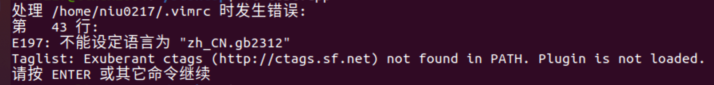

# Ubuntu常见操作

## 1. ubuntu修改主机名

**永久修改主机名：**

在Ubuntu系统中永久修改主机名也比较简单。主机名存放在/etc/hostname文件中，修改主机名时，编辑hostname文件，在文件中输入新的主机名并保存该文件即可。重启系统后，参照上面介绍的快速查看主机名的办法来确认主机名有没有修改成功。

修改主机名：`sudo vi /etc/hostname 将其中的名字改为自己的名字`，然后重启系统

**特别注意：**

如果是<font color=red>腾讯云的ubuntu</font>的话，上述修改就算重启了也不会生效，因为它每次重启都会执行脚步自动设置主机名。需要我们做如下设置：

```bash
sudo vi /etc/cloud/cloud.cfg
```

然后将其中的`preserve_hostname: false`改为`preserve_hostname: true`。这样它重启的时候就不会自动设置默认的主机名字了。

此解决方案来自于：https://zhuanlan.zhihu.com/p/372994818


## 2. 修改用户名

<font color=red>**重要：必须先切换到root用户，执行命令`su root`**</font>

+ 1 执行命令`gedit /etc/passwd`将原来的用户名改为你想要的用户名
+ 2 执行命令 `gedit /etc/shadow`将原来的用户名改为你想要的用户名
+ 3 执行命令`gedit /etc/group`将原来的用户名改为你想要的用户名，不止一个，全部都要修改
+ 4 执行命令`mv /home/ubuntu /home/test`其中ubuntu是原来的名字，test是修改之后的名字
+ 5 重启，修改成功🏅️


## 3. 安装PowerVIM

**1---下载安装包**

```
https://github.com/youngyangyang04/PowerVim
```

**2--进入PowerVim然后打开终端输入命令：**

```shell
sh install.sh
```

此时会报错

```
install.sh: 8: Syntax error: "(" unexpected
```

这是由于版本不同造成的，我们继续往下去解决这个问题。

执行命令：

```shell
sudo dpkg-reconfigure dash
# 在选择项中选No，即可。
```

这样这个问题就完美解决了。

**3--创建一个test.cpp文件。执行命令**

```c++
vi test.cpp
```

出现如下情况：

 

这个是语言和没有安装ctag造成的。

首先：执行如下命令安装ctag

```shell
sudo apt-get install ctags
```

然后执行命令`vi test.cpp`

 

是不是发现少了一个错误，因为我们已经安装了ctag所以少了一个错误，接下来解决语言的错误

```shell
https://gist.github.com/BoWang816/c2e9ce52ce03c59450bcf587b7d0f456


ubuntu中文支持，及中文乱码问题

该篇博文，是本人踩了一下午的坑的成果，亲测有效。对服务器同样有效。

状况：所用的ubuntu系统不支持中文，遇见中文就????。ORZ…

目标：使系统/服务器支持中文，能够正常显示。

首先，安装中文支持包language-pack-zh-hans：

$ sudo apt-get install language-pack-zh-hans
然后，修改/etc/environment（在文件的末尾追加）：

LANG="zh_CN.UTF-8"
LANGUAGE="zh_CN:zh:en_US:en"
再修改/var/lib/locales/supported.d/local(没有这个文件就新建，同样在末尾追加)：

en_US.UTF-8 UTF-8
zh_CN.UTF-8 UTF-8
zh_CN.GBK GBK
zh_CN GB2312
最后，执行命令：

$ sudo locale-gen
```

完美解决，现在可以编程了。


## 4.安装pwndbg

该方案来自于：[网址](https://hgg-bat.github.io/2021/10/04/pwn%E5%85%A5%E9%97%A8%E4%B9%8B%E7%8E%AF%E5%A2%83%E6%90%AD%E5%BB%BA/#%E5%AE%89%E8%A3%85pwndbg-pwngdb-%E8%81%94%E5%90%88%E8%B0%83%E8%AF%95%E7%8E%AF%E5%A2%83)

**第一步：安装pwntools**

```bash
sudo apt-get install python3 python3-pip python3-dev git libssl-dev libffi-dev build-essential
sudo python3 -m pip install --upgrade pip
sudo python3 -m pip install --upgrade pwntools
```

**第二步：安装pwngdb和pwndbg**

```bash
cd ~/
git clone https://github.com/scwuaptx/Pwngdb.git 
cp ~/Pwngdb/.gdbinit ~/
```

```bash
git clone https://github.com/pwndbg/pwndbg
cd pwndbg
./setup.sh
```

**第三步：修改文件**

```bash
vim ~/.gdbinit

注释掉第一行 然后在第二行写入
source ~/pwndbg/gdbinit.py
```

**简单使用**

```
带源码调试: gdb -q [file] -d [path]（默认为.）
打印链接库: vmmap
```


