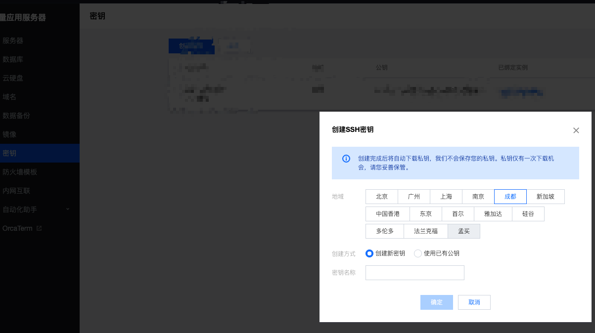
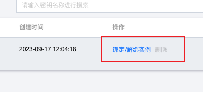

# mac使用ssh连接腾讯云服务器

## 准备工作

**第一步：新买的腾讯云服务器需要开启ssh服务。**

打开腾讯云服务器，输入命令：

```bash
sudo apt-get update
```

```bash
sudo apt-get install openssh-server
```

```bash
ps -e | grep ssh
# 这条命令主要是查看是否安装成功
```

**第二步：在腾讯云后台创建ssh**

 

之后点击下载将私钥保存在本地，到时候连接云服务器就是用这个<font color=red>私钥</font>来连接，所以一定要保存好。

**第三步：将公钥加载到服务器**

 

点击上面的按钮，注意服务器这时候必须处于关机状态。


## 终端使用ssh命令连接

打开终端并输入命令

```bash
ssh -i [私钥的本地路径] 服务器名字@服务器IP
```

之后顺利连接到了服务器。

<font color=red>注意</font>⚠️：可能会因为私钥的权限过于开放，导致我们执行连接命令失败，这个时候，我们只需要执行命令`chmod 600 私钥的名字`，这样就可以了。