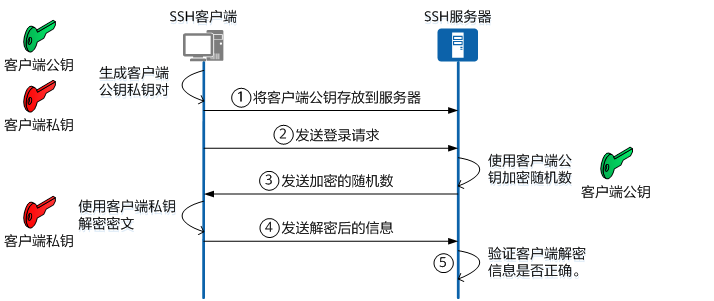

# mac使用ssh连接腾讯云服务器

## 什么是SSH

https://info.support.huawei.com/info-finder/encyclopedia/zh/SSH.html

## 准备工作

**第一步：新买的腾讯云服务器需要开启ssh服务。**

打开腾讯云服务器，输入命令：

```bash
sudo apt-get update
```

```bash
sudo apt-get install openssh-server
```

```bash
ps -e | grep ssh
# 这条命令主要是查看是否安装成功
```

**第二步：在腾讯云后台创建ssh**

 

之后点击下载将私钥保存在本地，到时候连接云服务器就是用这个<font color=red>私钥</font>来连接，所以一定要保存好。

**第三步：将公钥加载到服务器**

 

点击上面的按钮，注意服务器这时候必须处于关机状态。


## 终端使用ssh命令连接

打开终端并输入命令

```bash
ssh -i [私钥的本地路径] 服务器名字@服务器IP
```

之后顺利连接到了服务器。

<font color=red>注意</font>⚠️：可能会因为私钥的权限过于开放，导致我们执行连接命令失败，这个时候，我们只需要执行命令`chmod 600 私钥的名字`，这样就可以了。

**认证过程解释：**

为避免中间人攻击，可以使用安全性更高的密钥认证。密钥认证的基本原理是SSH服务器使用客户端的公钥对随机内容加密，SSH客户端使用自己的私钥解密并发送给服务器以证实自己的身份，具体的过程如下图所示。

 

*SSH密钥认证登录流程*

1. 在进行SSH连接之前，SSH客户端需要先生成自己的公钥私钥对，并将自己的公钥存放在SSH服务器上。
2. SSH客户端向SSH服务器发送登录请求。
3. SSH服务器根据请求中的用户名等信息在本地搜索客户端的公钥，并用这个公钥加密一个随机数发送给客户端。
4. SSH客户端使用自己的私钥对返回信息进行解密，并发送给SSH服务器。
5. SSH服务器验证SSH客户端解密的信息是否正确，如果正确则认证通过。

