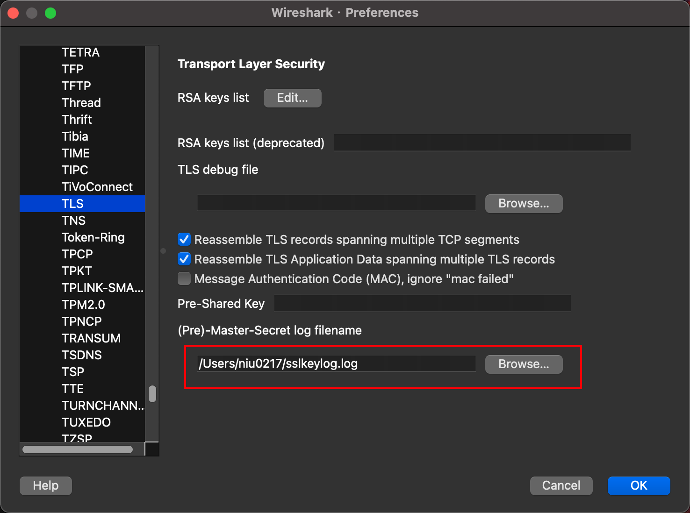
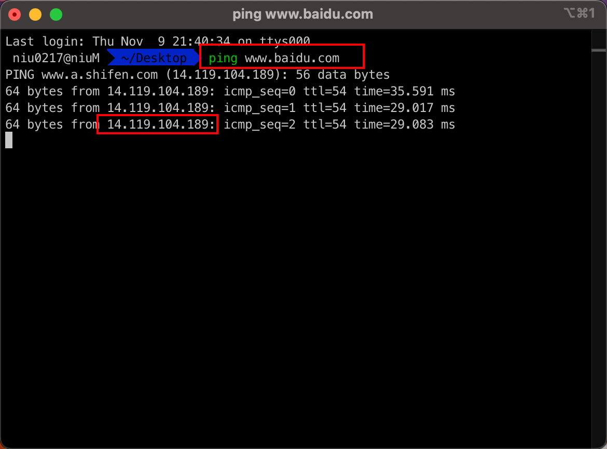
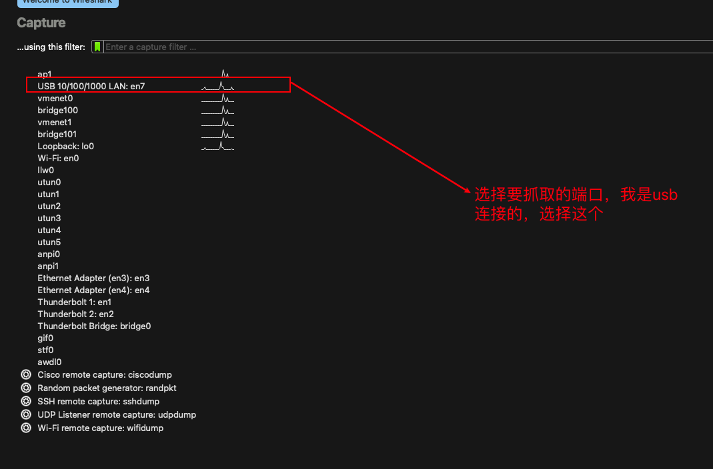
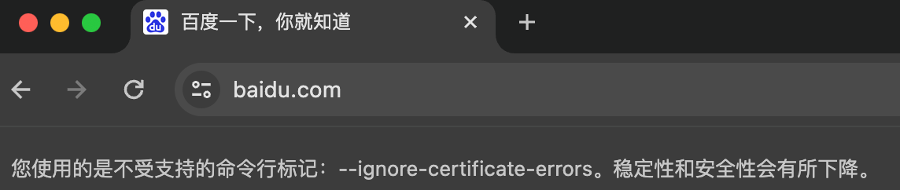
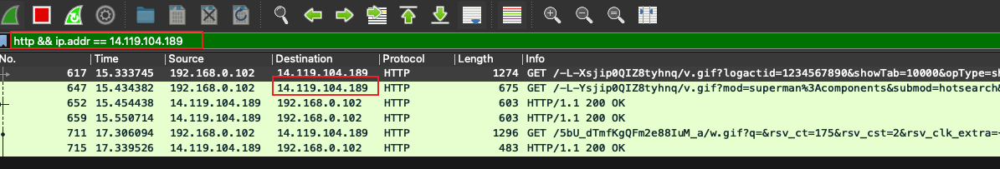

# mac使用wireshark抓取http包

## 1. 查找浏览器的地址

```shell
sudo find / -iname "Google Chrome"
#结果为/Applications/Google Chrome.app/Contents/MacOS/Google Chrome
```

## 2. 指定sslkey logfile和忽略证书告警的标志

```shell
sudo /Applications/Google\ Chrome.app/Contents/MacOS/Google\ Chrome --ssl-key-log-file=/Users/`whoami`/sslkeylog.log -ignore-certificate-errors
```

注释：这是一条命令

此时会新开一个浏览器窗口，在配置好wireshark之后可以使用这个窗口进行调试。

## 3. 修改sslkeylog.log文件的权限为777

```shell
sudo chmod 777 /Users/`whoami`/sslkeylog.log
```

## 4. 启动wireshark，配置sslkeylog

菜单栏 -> Wireshark -> Preferences -> Protocols -> TLS（旧版为SSL）在(Pre)-Master-Secret log filename填入刚才启动时指定的文件路径:

 

## 5. 查看百度的ip地址

 

## 6. 使用wireshark抓http包

先打开wireshark软件，选择要抓取的端口：

 

然后在步骤2中自动打开的浏览器中输入百度的网址并访问：

 

最后过滤你想要抓取的信息：

 

