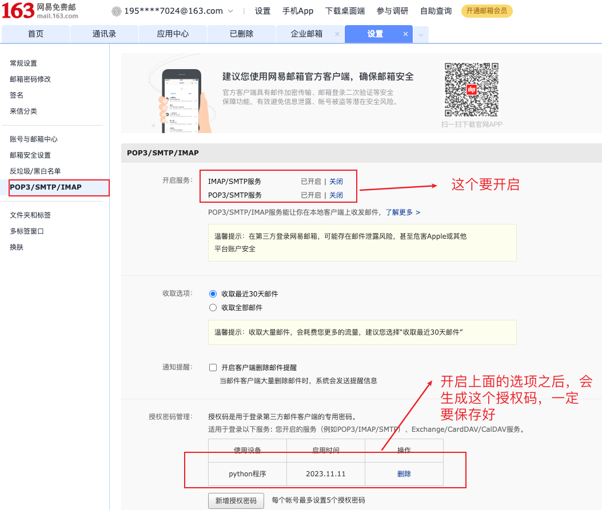

# 使用telnet给邮箱发消息

## 1. 邮件客户端原理

+ `helo <domain>`：`helo`命令是SMTP邮件发送程序与SMTP接收程序建立连接后<font color=red>必须发送的第一条命令</font>。参数`domain`是SMTP邮件发送者的主机名。
+ `auth <login | plain>`：当使用`helo`后，SMTP服务器会返回相应的命令，其中含有认证的方式。通常有login、plain两种，我们使用`auth login`之后就可以直接输入用户名和密码（这里的密码指的是授权码，后面有注解）即完成登陆。（需要注意的是要使用base64编码后的用户名和密码才可以登录）
+ `mail from: <xx@xx.com>`：此命令用于指定邮件发送者的邮箱地址，参数`<xx@xx.com>`表示发件人的邮箱地址
+ `rcpt to: <xx@xx.com>`：此命令用于指定邮件接收者的邮箱地址，参数`<xx@xx.com>`表示接收人的邮箱地址
+ `data`：此命令用于表示SMTP邮箱发送程序准备开始传送邮件内容，在这个命令后面发送的所有数据都将被当成邮箱内容，直到遇到“.”（单独的一行标识符），则表示邮件内容结束。
+ `quit`：此命令表示要结束邮件发送过程，SMTP邮件接收程序接收到此命令后，将关闭与SMTP邮件发送程序的网络连接。

注解：

+ 授权码：

 


## 2. 开始操作

```shell
 niu0217@niuM  ~/Desktop  telnet smtp.163.com 25
Connected to smtp.163.com.
Escape character is '^]'.
220 163.com Anti-spam GT for Coremail System (163com[20141201])
helo niu #命令1
250 OK
auth login #命令2
334 dXNlcm5hbWU6
MTk1LYUDNFONFJJHFH== #命令3
334 UGFzc3dvcmQ6
T0NDUFHJHFOJOSDSFDS== #命令4
235 Authentication successful
mail from: <xx@163.com> #命令5
250 Mail OK
rcpt to: <xx@qq.com> #命令6
250 Mail OK
data #命令7
354 End data with <CR><LF>.<CR><LF>
hello I am niu0217 #命令8
. #命令9
250 Mail OK queued as zwqz-smtp-mta-g4-2,_____wDHR7eDME9lY+R4Cw--.9070S2 1699688669
quit #命令10
221 Bye
Connection closed by foreign host.
```

注解：

+ 命令3：base64加密后的用户名（其实就是邮箱名字）
+ 命令4：base64加密后的授权码（打开POP3/SMTP服务后自动生成的）
+ 命令5：发送者的邮箱
+ 命令6：接受者的邮箱
+ 命令8，9：发送的消息，其中命令9代表结束标志

